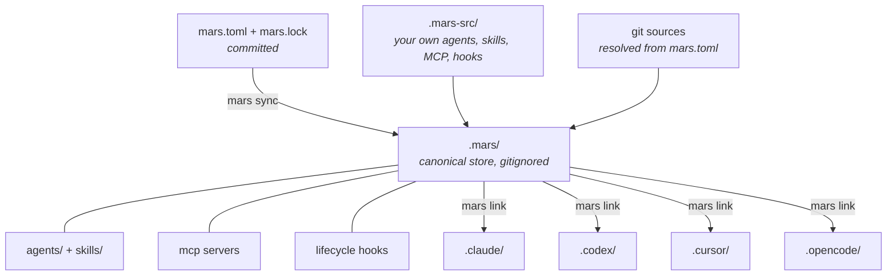

# mars

A package manager for AI agent profiles and skills. Install agents and skills from git sources into Claude Code, Cursor, Codex, OpenCode — any tool that reads from a config directory.

## Install

| Method | Command |
|---|---|
| Cargo | `cargo install mars-agents` |
| pip / uv | `uv tool install mars-agents` or `pip install mars-agents` |
| npm | `npm install -g @meridian-flow/mars-agents` |
| Prebuilt binaries | [GitHub Releases](https://github.com/meridian-flow/mars-agents/releases) |

## Quick Start

```bash
mars init
mars add meridian-flow/meridian-dev-workflow
mars link .claude
mars link .codex
```

Your agents and skills are now installed and available in both Claude Code and Codex. Update them with `mars upgrade`, check for drift with `mars doctor`.

## Adding Sources

```bash
# From GitHub
mars add meridian-flow/meridian-base
mars add acme/security-agents --only-agents

# From a local directory
mars add ../my-team-agents

# Pin a version
mars add meridian-flow/meridian-base@^1.0
```

## Model Aliases

Packages can distribute model routing — short names that resolve to concrete models across harnesses:

```bash
mars models list
mars models resolve opus
```

```toml
# In mars.toml — override any alias
[models.opus]
harness = "claude"
provider = "Anthropic"
match = ["*opus*"]
```

## How It Works



Mars resolves the full dependency graph before touching any files. Writes are atomic. The lock file tracks what mars manages so it never touches your files. Each linked target gets harness-native artifacts — agents, skills, MCP servers, and hooks compiled to match what that tool expects.

Use `mars adopt` to bring an existing unmanaged file into `.mars-src/` in one step.

## Docs

- [Config](docs/config/) — `mars.toml`, agent profiles, compilation, MCP/hooks
- [CLI](docs/cli/commands.md) — every command with flags and examples
- [Internals](docs/internals/) — sync pipeline, lock file, conflicts
- [Dev](docs/dev/) — local development, troubleshooting, smoke testing

## License

MIT
