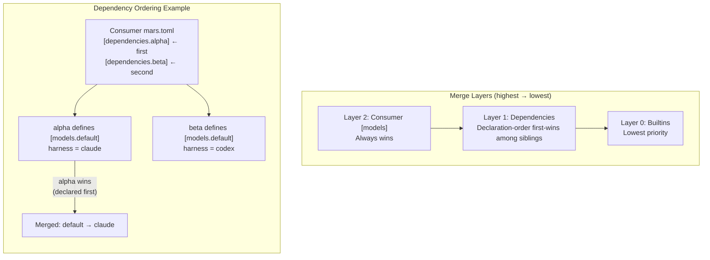

# Configuration Reference

## Terminology

- **Project root**: directory containing `mars.toml` and `mars.lock`.
- **Canonical store**: `.mars/`, the full-fidelity compiled output Mars owns.
- **Target sync**: optional copies from `.mars/` into managed target directories, configured by `settings.targets`.
- **`--root`**: points to the project root when you need to override auto-detection.

Mars uses three config files, all at the project root:

| File | Purpose | Committed? |
|---|---|---|
| `mars.toml` | Dependencies, filters, settings | Yes |
| `mars.lock` | Resolved versions, checksums, ownership | Yes |
| `mars.local.toml` | Developer-local overrides | No (gitignored) |

## Layering and precedence

Mars applies configuration layers in this precedence order:

`user config < mars.toml < mars.local.toml < CLI/command inputs`

Current implementation uses `mars.toml < mars.local.toml < CLI/command inputs`; the user layer is reserved in the merge boundary for future support.

Default merge semantics:

- **Scalars / Option values:** higher layer replaces lower layer when present.
- **Maps / tables:** higher layer adds/replaces entries by key.
- **Arrays/lists:** higher layer replaces the full list (including explicit `[]`).

For keyed overlay tables:

- `[models]` overlays are **replace-by-key** per alias entry (no recursive field merge inside one alias block).
- `[agents]` overlays are **replace-by-key** per agent entry (no recursive field merge inside one agent block).

## `mars.toml`

### `[package]` (optional)

Present only in source packages — repos that other projects depend on via `mars add`. Consumer projects that just install agents/skills from external packages do not need this section.

To keep project-local agents and skills without publishing, use `.mars-src/` instead. See [local-development.md](../dev/local-development.md#mars-src----project-local-agents-and-skills).

```toml
[package]
name = "meridian-base"
version = "1.2.0"
description = "Core agents and skills for meridian"  # optional
```

| Field | Type | Required | Description |
|---|---|---|---|
| `name` | string | yes | Package name, used for dependency resolution |
| `version` | string | yes | Semver version of this package |
| `description` | string | no | Human-readable description |

When `[package]` is present, Mars also reads legacy repo-root `agents/` and `skills/` directories during sync. `.mars-src/` always takes precedence over the legacy root if an item name is defined in both.

### `[dependencies]`

Each key is the dependency name (the identifier Mars commands use). Each value specifies the source and optional filters.

`mars add` derives the dependency name from the source specifier by default. Example: `mars add meridian-flow/meridian-base` creates `[dependencies.meridian-base]`.

```toml
[dependencies.base]
url = "https://github.com/meridian-flow/meridian-base"
version = "^1.0"

[dependencies.dev]
path = "../my-dev-agents"

[dependencies.ops]
url = "https://github.com/acme/ops-agents"
agents = ["deployer", "monitor"]
skills = ["deploy-flow"]

[dependencies.toolkit]
url = "https://github.com/acme/toolkit"
only_skills = true
```

Commands such as `mars remove`, `mars override`, `mars upgrade`, and `mars why` take dependency names, not source URLs. Use `mars list --status` to see the `SOURCE` column and `mars list --source <name>` to filter by one dependency.

#### Source fields

Each dependency must have exactly one of `url` or `path` (not both, not neither).

| Field | Type | Description |
|---|---|---|
| `url` | string | Git URL (HTTPS, SSH, or GitHub shorthand expanded to HTTPS) |
| `path` | string | Local filesystem path (relative to project root or absolute) |
| `subpath` | string | Optional package root under the fetched repo or local path |
| `version` | string | Version constraint for git sources (see [Version Constraints](#version-constraints)) |

`subpath` is the explicit escape hatch for monorepo packages. When omitted, Mars discovers from the source root itself.

Supported source forms in v1:
- GitHub shorthand, `github:` aliases, repo URLs, and tree URLs
- GitLab `gitlab:` aliases, repo URLs, and tree URLs, including subgroup and custom-host forms
- Generic git SSH or `git://` URLs
- Local filesystem paths

Explicitly unsupported in v1:
- archive-download URLs such as `.zip`, `.tar.gz`, or similar
- direct file-download URLs such as `raw` or individual `SKILL.md` links

#### Filter fields

Filters control which agents and skills from a source are installed. Only one filter mode is active at a time.

| Field | Type | Description |
|---|---|---|
| `agents` | string[] | Install only these named agents (include mode) |
| `skills` | string[] | Install only these named skills (include mode) |
| `exclude` | string[] | Install everything except these named items |
| `only_skills` | bool | Install only skills, no agents |
| `only_agents` | bool | Install only agents plus their transitive skill dependencies (skills those agents declare and therefore require) |
| `rename` | table | Rename mappings (see [Renaming](#renaming)) |

#### Filter mode rules

These combinations are **rejected** at config load and CLI parse time:

| Combination | Reason |
|---|---|
| `only_skills` + `only_agents` | Mutually exclusive |
| `only_skills` + `agents` | Category-only conflicts with include list |
| `only_agents` + `skills` | Category-only conflicts with include list |
| `exclude` + `agents`/`skills` | Can't include and exclude simultaneously |
| `exclude` + `only_skills`/`only_agents` | Can't exclude and restrict category |

When no filter fields are set, all agents and skills from the source are installed (**All** mode).

#### Include mode behavior

When `agents` and/or `skills` lists are provided:

- Only named agents and named skills are installed
- If a named agent's **frontmatter** (the YAML metadata block at the top of the Markdown file) declares skill dependencies, those transitive skills are also installed automatically
- Items not found in the source are silently absent (warning at sync time)

#### `only_agents` behavior

- All agents from the source are installed
- Skills referenced by those agents' frontmatter are installed (**transitive skill dependencies**: indirectly required skills pulled in through agent declarations)
- Standalone skills not referenced by any agent are excluded

### `[local-dependencies]`

Local dependency declarations have the same shape as `[dependencies]`, but are developer-local and are not exported to package manifests.

Use them for private checkouts, local prompt repos, and temporary development wiring:

```toml
[local-dependencies.prompter]
path = "../prompts/meridian-prompter"
```

Rules:

- Same source and filter fields as `[dependencies]`
- Merged into the effective config for local commands
- Not exported when publishing package metadata
- Cannot reuse a name already declared in `[dependencies]`

### `[settings]`

```toml
[settings]
targets = [".claude", ".cursor"]
agent_emission = "auto"
min_mars_version = "0.12.0"
models_cache_ttl_hours = 24

[settings.agent_copy]
harnesses = ["claude"]
include_fanout = false

[settings.model_visibility]
include = ["anthropic/*", "openai/gpt-5*"]  # Show only these
exclude = ["*-preview*", "*-latest"]         # Then hide these
```

| Field | Type | Default | Description |
|---|---|---|---|
| `targets` | string[] | unset | Managed target directories copied from `.mars/` |
| `managed_root` | string | unset | Legacy single target directory; used only when `targets` is unset |
| `agent_emission` | string | `"auto"` | Native harness agent emission: `auto`, `always`, or `never` |
| `agent_copy` | table | unset | Selective native agent copy override under managed mode / `agent_emission = "never"` |
| `min_mars_version` | string | unset | Minimum Mars binary version required for this project |
| `models_cache_ttl_hours` | integer | `24` | Model catalog cache TTL; `0` forces refresh |
| `default_harness` | string | unset | Default harness for launch routing when profile/alias/provider cannot resolve one |
| `default_model` | string | unset | Project-wide default model token when neither `--model` nor the agent profile sets one. |
| `model_visibility` | table | `{}` | Consumer-only display filter for `mars models list` output |

`.mars/` is always the canonical compiled store. Target sync is opt-in: if neither `targets` nor legacy `managed_root` is set, Mars creates no target-sync targets by default.

`[settings.agent_copy]` is the intentional exception to blanket native-agent suppression. It emits selected harness-native copies even when `MERIDIAN_MANAGED=1` or `agent_emission = "never"`; `agent_emission = "always"` still emits all native agents instead.

| Field | Type | Default | Description |
|---|---|---|---|
| `harnesses` | string[] | `[]` | Harnesses to receive selective native agent copies; each harness target must also be an effective managed target |
| `include_fanout` | bool | `false` | Also qualify agents through matching `model-policies` / fanout rules |

Qualifying agents have a matching `harness:`, a `model:` alias that resolves to the listed harness, or — with `include_fanout = true` — a matching `model-policies` rule. For Claude, use `harnesses = ["claude"]` with `.claude` as an effective managed target (from `settings.targets`, or legacy `managed_root` when `targets` is unset) to materialize Claude-native `Agent()` copies while Meridian continues to use `.mars/agents/` for normal `meridian spawn` delegation.

## Model Visibility

Configure which models appear in `mars models list`. Consumer-only - not merged from dependencies.

### Example

```toml
[settings.model_visibility]
include = ["anthropic/*", "openai/gpt-5*"]  # Show only these
exclude = ["*-preview*", "*-latest"]         # Then hide these
```

| Field | Type | Description |
|---|---|---|
| `include` | string[] | Glob patterns; only matching aliases are shown |
| `exclude` | string[] | Glob patterns; matching aliases are hidden |

### Behavior

- `include` alone: show only matching models
- `exclude` alone: show all except matching models
- Both: apply include first, then exclude from that set
- Neither: show all (no filtering)

CLI `--include`/`--exclude` replace config entirely for that invocation.

## OpenCode Probe

When OpenCode is installed, mars probes for available model slugs:

- Runs `opencode models` to get available model slugs
- Probe timeout configurable via `MARS_PROBE_TIMEOUT_SECS` (default: 5)
- Probe failures degrade to `unknown`, not `unavailable`
- No credential values are logged

Use `--no-refresh-models` or `MARS_OFFLINE=1` to skip probing.

## Version Constraints

Mars uses [semver](https://semver.org/) for version resolution. Sources tag releases with `v`-prefixed semver tags (e.g., `v1.2.3`).

| Constraint | Meaning | Example |
|---|---|---|
| `^1.0` | Compatible with 1.x (>=1.0.0, <2.0.0) | `version = "^1.0"` |
| `~1.2` | Patch-level changes only (>=1.2.0, <1.3.0) | `version = "~1.2"` |
| `>=0.5.0` | At least this version | `version = ">=0.5.0"` |
| `=1.2.3` | Exact version | `version = "=1.2.3"` |
| `v1.2.3` | Exact version (v-prefix) | `version = "v1.2.3"` |
| *(omitted)* | Latest available (HEAD for untagged repos) | |

Branch or commit pins (non-semver strings) bypass version resolution entirely and fetch the specified ref directly.

## Renaming

Rename mappings let you change the installed name of an item from a source. This is useful for resolving naming collisions or for preferring shorter names.

Renames are set via `mars rename` (which updates the dependency's `rename` field) or by editing `mars.toml` directly:

```toml
[dependencies.base]
url = "https://github.com/meridian-flow/meridian-base"
rename = { "agents/coder__meridian-flow_meridian-base.md" = "agents/coder.md" }
```

## `[models]`

Model aliases map short names (e.g. `opus`, `sonnet`) to concrete model IDs or resolution patterns. Packages distribute aliases in their `mars.toml` under `[models]`; consumers can define their own to override or supplement.

```toml
# Pinned — explicit model ID
[models.opus]
harness = "claude"
model = "claude-opus-4-6"

# Auto-resolve — pattern matching against cached model catalog
[models.sonnet]
harness = "claude"
provider = "Anthropic"
match = ["sonnet"]
exclude = ["thinking"]
```

| Field | Type | Required | Description |
|---|---|---|---|
| `harness` | string | yes | Which harness runs this model (`claude`, `codex`, `opencode`, etc.) |
| `model` | string | no | Explicit model ID. If set, skips auto-resolution. |
| `provider` | string | no | API provider name for auto-resolution filtering |
| `description` | string | no | Human-readable description shown in `mars models list` |
| `match` | string[] | no | Glob patterns matched against the model catalog |
| `exclude` | string[] | no | Glob patterns to exclude from matches |
| `autocompact` | u32 | no | Token count threshold that triggers context compaction (0–4294967295) |
| `autocompact_pct` | u8 | no | Context fill percentage (1–100) that triggers compaction; alternative to `autocompact` |

When `model` is omitted, Mars auto-resolves by querying the cached model catalog with `match`/`exclude` patterns and selecting the best match.

### Merge Precedence

During sync, model aliases from the full dependency tree are merged into a single alias map. Three layers participate, highest priority first:

1. **Consumer `[models]`** — always wins. If you define `[models.opus]` in your `mars.toml`, no dependency can override it.
2. **Dependencies** — declaration order in `mars.toml` breaks ties. The dep listed first wins when two siblings define the same alias.
3. **Builtins** — lowest priority (mars ships zero builtins today, but the layer exists).

Within the dependency tree, the ordering follows these rules:

- **Siblings**: declaration order in the consumer's `[dependencies]` section. First-listed dep wins.
- **Transitive deps within a subtree**: the parent dep's `mars.toml` declaration order determines its children's relative ordering.
- **Dependent overrides its own deps**: if dep B depends on dep D and both define alias `x`, B wins (it appears later in topological order).
- **Diamond deps**: when a transitive dep is reachable from multiple direct deps, it inherits the position of the earliest (first-declared) direct dep that reaches it.



### Conflict Warnings

When a sibling tiebreak resolves a conflict, Mars emits a warning naming both deps:

```
warning: model alias `default` defined by both `alpha` and `beta` — using alpha (declared first)
  → add [models.default] to your mars.toml to resolve explicitly
```

If three or more deps define the same alias, Mars emits one warning per losing dep. Adding a consumer `[models]` override for that alias suppresses the warning entirely (the override is intentional, not a tiebreak).

Conflicts never block sync — they warn and continue.

### Persistence

Dependency-sourced alias winners are persisted in committed `mars.lock` under `dependency_model_aliases` during finalize. Consumer aliases are **not** baked into lock state — `mars models list` overlays fresh consumer config at read time.

## `mars.local.toml`

Developer-local overlays. Gitignored by `mars init`.

```toml
[overrides.base]
path = "../meridian-base"

[settings]
harness_order = ["codex", "pi"]
default_model = "gpt-5"

[models.fast]
model = "gpt-5.4-mini"

[agents.reviewer]
model = "fast"
```

Each key under `[overrides]` must match a dependency name in `mars.toml`. The override replaces the source URL with a local path for resolution and sync. The original git spec is preserved internally so `mars doctor` can still validate config consistency.

Local overlays can target:

- `[overrides]` dependency source swaps
- `[settings]` project-local settings
- `[models]` alias additions/overrides
- `[agents]` agent overlay additions/overrides

For local overlay semantics:

- Maps replace by key.
- Arrays replace by value.
- Scalars/options replace when present.
- `[models.<alias>]` and `[agents.<name>]` entries replace the full keyed block from `mars.toml` when the same key appears in `mars.local.toml`.

Unknown keys under `mars.local.toml [settings]` are rejected.

`mars models list` / `mars models resolve` now return local-config parse/validation errors instead of silently falling back to defaults. Fallback-to-default only happens when `mars.toml` is absent.

If an override references a dependency name not in config, Mars prints a warning but continues.

See [local-development.md](../dev/local-development.md) for workflows.

## Reserved Names

- `_self` is reserved for project-local items: agents and skills discovered from `.mars-src/` (always) and from the legacy repo-root `agents/`/`skills/` directories (only when `[package]` is present). `_self` is the synthetic source name used in the lock file and in `mars list --status` output for these items.
