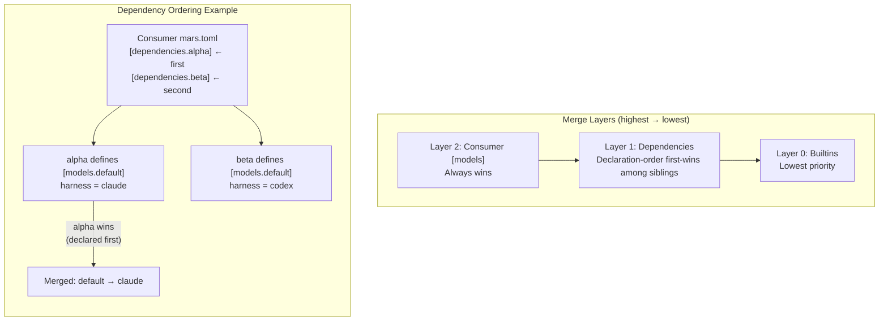

# Configuration Reference

## Terminology

- **Project root**: directory containing `mars.toml` and `mars.lock`.
- **Canonical store**: `.mars/`, the full-fidelity compiled output Mars owns.
- **Target sync**: optional copies from `.mars/` into managed target directories, configured by `settings.targets`.
- **`--root`**: points to the project root when you need to override auto-detection.

Mars uses three project files plus an optional user file:

| File | Purpose | Committed? |
|---|---|---|
| `mars.toml` | Dependencies, filters, settings | Yes |
| `mars.lock` | Resolved versions, checksums, ownership | Yes |
| `mars.local.toml` | Developer-local overrides | No (gitignored) |
| `$MARS_CONFIG_DIR/config.toml` (otherwise the platform `mars/config.toml`) | Your own `[settings]`, `[models]`, `[agents]` and `[skills]` for every project, in the `mars.local.toml` schema | User-owned |

## Layering and precedence

Mars applies configuration layers in this precedence order:

`user config < mars.toml < mars.local.toml < CLI/command inputs`

Default merge semantics:

- **Scalars / Option values:** higher layer replaces lower layer when present.
- **Maps / tables:** higher layer adds/replaces entries by key.
- **Arrays/lists:** higher layer replaces the full list (including explicit `[]`), except the
  permission sets below.
- **Permission sets:** plain lists add; `{ replace = [...] }` clears lower entries first. This
  applies only to network allow/deny hosts and tool grants/denies. See
  [Adding to or replacing a permission list](#adding-to-or-replacing-a-permission-list).

For keyed overlay tables:

- `[models]` overlays are **replace-by-key** per alias entry (no recursive field merge inside one alias block).
- `[agents]` and `[skills]` are also **replace-by-key** for scalars, options, model policies,
  and unknown keys. An agent's network and tool permission sets are the exception: they compose
  across matching project/local entries with the add/replace rule.

### Adding to or replacing a permission list

Four lists are permission lists:
- `network-allow`
- `network-deny`
- `tools.allowed`
- `tools.disallowed`

When more than one place sets one of these lists, Mars combines them. The places, from lowest
to highest:

- Network hosts: user config < `mars.toml` `[settings]` < `mars.local.toml` `[settings]` < agent profile < `[agents.<name>]` overlay < CLI flags
- Tools: agent profile `tools` < `[agents.<name>.tools]` in `mars.toml` < `[agents.<name>.tools]` in `mars.local.toml`

A plain list **adds** its entries to what lower places gave:

```toml
# mars.toml
[settings]
network-allow = ["github.com"]

# mars.local.toml
[settings]
network-allow = ["pypi.org"]   # result: github.com, pypi.org
```

To **discard** what lower places gave and use only your entries, write the list inside a
`replace` table. Places above this one still add on top:

```toml
[agents.coder]
network-allow = { replace = ["github.com"] }   # ignores user/project/profile hosts

[agents.coder.tools]
allowed = { replace = ["read", "grep"] }       # ignores the profile's and the project block's allows
```

The same in profile YAML frontmatter is `network-allow: {replace: [github.com]}`.

Limits:
- A package's agent profile can't replace a **deny** list (`network-deny`), and can't use
  `replace` for tools at all; both are errors. Profiles sit above your `[settings]` hosts, so a
  package could otherwise erase your denies, and they sit below your tool overlays, so a package
  has no lower tool policy to replace. Your own config files and overlays can replace anything.
- CLI flags (`--network-allow`, `--network-deny`) only add.
- An empty plain list (`[]`) adds nothing. `{ replace = [] }` clears the lower entries.

## `mars.toml`

### `[package]` (optional)

Present only in source packages — repos that other projects depend on via `mars add`. Consumer projects that just install agents/skills from external packages do not need this section.

To keep project-local agents and skills without publishing, use `.mars-src/` instead. See [local-development.md](../dev/local-development.md#mars-src--project-local-agents-and-skills).

```toml
[package]
name = "meridian-base"
version = "1.2.0"
schema = 1
description = "Core agents and skills for meridian"  # optional
authors = ["Example Maintainer <maintainer@example.com>"] # optional; table form also accepted
homepage = "https://github.com/example/meridian-base" # optional
license = "Apache-2.0"                                # optional
requires-mars = ">=0.20.0"                           # optional
requires-meridian = ">=0.15.0"                       # optional
```

| Field | Type | Required | Description |
|---|---|---|---|
| `name` | string | yes | Package name, used for dependency resolution |
| `version` | string | yes | Semver version of this package; a missing version warns |
| `schema` | integer | yes | The definition format the package uses: `1`. See [Schema v1](schema-v1.md). A package without it is read as pre-v1 and upgraded in memory, with a warning; `mars migrate` adds it. Any other number is refused |
| `description` | string | no | Human-readable description |
| `authors` | string[] or table[] | no | Package authors as `"Name <email>"` strings or `{ name, email }` tables; the first author supplies generated plugin owner metadata |
| `homepage` | string | no | Package or project homepage used in generated plugin manifests |
| `license` | string | no | Package license identifier used in generated plugin manifests |
| `requires-mars` | semver requirement | no | Mars versions that can consume this package. A schema 1 package needs a floor of `>=0.20.0`, the first Mars that reads schema 1: `mars check` warns when one is missing or lower, and `mars migrate` adds it only when the package has none (an existing requirement is reported, never rewritten) |
| `requires-meridian` | semver requirement | no | Meridian versions that can consume this package; skipped when Mars runs standalone |
| `uses-providers` | string[] | no | The hosts the package expects to supply skills at sync time, such as `["meridian"]`; each is a provider name (`[a-z0-9][a-z0-9-]*`). See [Provided skills and `uses-providers`](#provided-skills-and-uses-providers) |

#### Provided skills and `uses-providers`

A host program (Meridian) can install skills of its own with [`mars provide`](../cli/commands.md#mars-provide). They are named `<skill>__<provider>` and live in `.mars/skills/`, recorded in a machine-local `.mars/provided.lock`, outside `mars.toml`, `mars.lock` and the dependency graph. A package whose agents list such a skill under `skills:` declares the provider so the ref is valid on every machine:

```toml
[package]
name = "my-agents"
version = "0.1.0"
schema = 1
requires-mars = ">=0.20.0"
uses-providers = ["meridian"]
```

A dependency's agent that lists `x__meridian`:

| `uses-providers` lists `meridian` | Provider has provided `x__meridian` here | Result |
|---|---|---|
| yes | yes | Satisfied, silently |
| yes | no | Sync continues with a `provided-skill-unavailable` warning; `mars validate --strict` fails |
| no | either | Resolution fails with `skill not found`, on every machine |

The resolver reads only the requesting package's own list, never what the machine has provided, so a package resolves the same everywhere and a typo such as `x__meridain` stays an error. A package skill named `x__meridian` is always found first, and wins its destination from a provided copy: the next `mars sync` replaces it and the next `mars provide` drops its record. `mars.lock` is the same with or without the provider.

Project-local agents (`.mars-src/`, or a package repository's own items) are checked by sync against what is provided here. A consumer project needs no `[package]` table and no declaration. In a package repository, a ref to a skill that is provided here but whose provider is not listed warns `provided-skill-undeclared`, so the author sees what consumers will hit, and `mars check` (the publish gate, which ignores `.mars/provided.lock`) fails naming `uses-providers`. A package that sets `uses-providers` also sets `requires-mars` to a Mars that understands it; an older Mars fails on the requirement instead of `skill not found`. `mars build plugin` never ships a provided skill and reports `provided-skill-unavailable` for an agent that lists a declared provider's skill.

Bare engine versions such as `"0.11"` mean a minimum (`">=0.11.0"`).
Full semver ranges are also accepted. During dependency resolution Mars skips
incompatible releases and selects the newest compatible older release. If no
release is compatible, sync stops before writing. The consumer project's own
`[package]` requirements are hard errors because there is no version to fall
back to. `mars check` validates both fields before publishing.

`--ignore-requires-mars` and `--ignore-requires-meridian` disable the
corresponding check for `sync`, `upgrade`, `add`, and `repair`, and always emit
a warning.

Project-local items are read from `.mars-src/` during sync. With `[package]`, the current package also supplies its own agents and skills as Mars-native `_self` items. `.mars-src` overrides a matching package item before staging; self items then overlay matching dependency destinations after dependency renames. Source-package discovery walks the rooted package tree and includes convention folders named `agents/`, `skills/`, and `bootstrap/` at non-hidden depth up to `MAX_DISCOVERY_WALK_DEPTH = 5`, grounded to the shallowest discovered package layer. Duplicate `(kind, name)` items in one source fail with `DiscoveryCollision`.

### `[plugin]` (optional)

Adding `[plugin]` opts a package into committed plugin builds. Every field is optional:

```toml
[plugin]
dir = "plugin"
name = "meridian-base"
marketplace = "meridian-base"
description = "Core agents and skills for Meridian"
harnesses = ["claude", "codex", "grok", "cursor", "opencode"]
```

| Field | Type | Default | Description |
|---|---|---|---|
| `dir` | relative path | `"plugin"` | Mars-owned output directory containing the generated harness trees |
| `name` | string | `[package].name` | Plugin identifier and namespace |
| `marketplace` | string | `[package].name` | Marketplace/catalog identifier used with `name@marketplace` installs |
| `description` | string | `[package].description` | Plugin-facing description |
| `harnesses` | string[] | every supported harness | Harnesses the build serves: `claude`, `codex`, `grok`, `cursor`, and `opencode`. Harnesses added in later releases join the default |

`dir` must stay inside the package and cannot be `.`, `..`, a dot directory, or an
`agents`, `skills`, `hooks`, or `bootstrap` source directory. Absolute paths and parent
components are rejected. Pi has no plugin format and cannot be listed.

`name` must satisfy every listed harness. Cursor and Codex require lowercase identifiers
made from letters, digits, dots, and hyphens; OpenCode requires an npm-compatible package
name. Claude-compatible names cannot contain spaces, `@`, `:`, or path separators.

Config loading preserves the raw `plugin` value and the plugin-only package fields `authors`,
`homepage`, and `license` as raw TOML. Defaults and semantic checks run only when building a plugin
or versioning a package that declares `plugin`: output containment, field types, non-empty author
names, plugin and marketplace names for every selected harness, and the selected harness list.
Invalid plugin metadata therefore does not block `sync`, `list`, `add`, `doctor`, or config loading.
`mars check` reports the same validation message as a warning. Config-saving commands keep omitted
plugin defaults omitted and retain authored metadata forms such as
`authors = ["Name <email>"]`; even a non-table value is preserved until plugin validation reports
that `[plugin]` must be a table.

Run `mars build plugin` in the package to rebuild configured output. Running
`mars build plugin --out <dir>` instead writes only the owned output directory, accepts packages without
`[plugin]`, and uses the configured harness list when one exists. An explicit `--out` cannot
resolve to `[plugin].dir`; omit `--out` for that build.

### `[dependencies]`

Each key is the dependency name (the identifier Mars commands use). Each value specifies the source and optional filters.

`mars add` derives the dependency name from the source specifier by default. Example: `mars add meridian-flow/meridian-base` creates `[dependencies.meridian-base]`.

```toml
[dependencies.base]
url = "https://github.com/meridian-flow/meridian-base"
version = "^1.0"

[dependencies.dev]
path = "../my-dev-agents"

[dependencies.ops]
url = "https://github.com/acme/ops-agents"
agents = ["deployer", "monitor"]
skills = ["deploy-flow"]

[dependencies.toolkit]
url = "https://github.com/acme/toolkit"
only_skills = true
```

Commands such as `mars remove`, `mars override`, `mars upgrade`, and `mars why` take dependency names, not source URLs. Use `mars list --status` to see the `SOURCE` column and `mars list --source <name>` to filter by one dependency.

#### Source fields

Each dependency must have exactly one of `url` or `path` (not both, not neither).

| Field | Type | Description |
|---|---|---|
| `url` | string | Git URL (HTTPS, SSH, or GitHub shorthand expanded to HTTPS) |
| `path` | string | Local filesystem path (relative to project root or absolute) |
| `subpath` | string | Optional package root under the fetched repo or local path |
| `version` | string | Version constraint for git sources (see [Version Constraints](#version-constraints)) |
| `dialect` | string | Inbound lift dialect: `claude`, `agent-skills`, `codex`, `opencode`, `cursor`, or `mars-native` (see [Dialect](#dialect)) |
| `plugin` | string | The plugin to install from the Claude marketplace at this source (see [Marketplace plugins](#marketplace-plugins)) |

`subpath` is the explicit escape hatch for monorepo packages and foreign hidden layouts. When omitted, Mars discovers from the source root itself and skips dot-prefixed directories. To import a Claude-authored package stored under `.claude/`, set `subpath = ".claude"` and `dialect = "claude"`; the inner `agents/` and `skills/` folders are then discovered normally.

#### Marketplace plugins

A Claude marketplace (a repository with `.claude-plugin/marketplace.json`) publishes several plugins. `plugin = "<name>"` beside `url` (or `path`) installs one of them, and each plugin is its own dependency, package and lock entry:

```toml
[dependencies."skills/document-skills"]
url = "https://github.com/anthropics/skills"
plugin = "document-skills"

[dependencies."skills/example-skills"]
url = "https://github.com/anthropics/skills"
plugin = "example-skills"
```

`mars add https://github.com/anthropics/skills --plugin document-skills` writes the first entry; the dependency is named `<repo>/<plugin>`. A marketplace dependency without `plugin` installs the marketplace's only plugin, wherever its files are; with several plugins it is an error that lists them. The lock records `plugin` and `content` only for a dependency that names its plugin (and `content` for a plugin in another repository), so a lock written before `plugin` existed still describes a dependency that names none. `version` constrains the marketplace's tags and commits like any git dependency; `mars outdated` reports them.

The marketplace is read at the root of its source, and the plugin's entry says where its files are:

| Entry `source` | Plugin files |
|---|---|
| `"./<path>"` or `"."` | That directory of the marketplace checkout |
| `{source: "github", repo, ref?, sha?}` | `github.com/<repo>` |
| `{source: "url", url, ref?, sha?}` | That git repository |
| `{source: "git-subdir", url, path, ref?, sha?}` | That repository, rooted at `path` |

A remote repository is fetched at the entry's `sha`, else its `ref`, else its default branch. Mars fetches any git URL a dependency of its own could name, GitHub or not; the shapes that are not git (`npm`, `archive`, `command`) are an error that names the shape. A remote plugin that is itself a marketplace is refused. The entry is third-party text, so a repository that starts with `-`, has whitespace or no recognized form (`https://`, `ssh://`, `user@host:path`) is refused, and only a marketplace read from a local source (a `path` or a `file://` URL) may name a local repository.

`plugin` cannot be combined with `subpath` (the marketplace entry says where the plugin is) or `dialect` (a marketplace plugin is read as a Claude plugin); a `plugin` that is not one name (letters, digits, `-`, `_` and `.`, starting with a letter or digit), one the marketplace does not list, and a source that is not a marketplace are errors that say so (the unknown name lists the plugins).

`mars.lock` records two commits for a plugin whose files live in another repository: the marketplace's (`url`, `version`, `commit`, where every dependency keeps them) and the plugin content's (`content.url`, `content.subpath`, `content.commit`); see [Lock File](../internals/lock-file.md). `mars sync` fetches both locked commits and changes nothing while the marketplace stays at its locked commit and its entry names the same repository and path. `mars upgrade` re-reads the marketplace at its ref, takes the plugin's current source from it and resolves the content commit anew, and reports a plugin whose source moved ("old -> new"). `mars sync --frozen` requires the locked content commit.

Supported source forms in v1:
- GitHub shorthand, `github:` aliases, repo URLs, and tree URLs
- GitLab `gitlab:` aliases, repo URLs, and tree URLs, including subgroup and custom-host forms
- Generic git SSH or `git://` URLs
- Local filesystem paths

Explicitly unsupported in v1:
- archive-download URLs such as `.zip`, `.tar.gz`, or similar
- direct file-download URLs such as `raw` or individual `SKILL.md` links

#### Filter fields

Filters control which agents and skills from a source are installed. Only one filter mode is active at a time.

| Field | Type | Description |
|---|---|---|
| `agents` | string[] | Install only these named agents (include mode) |
| `skills` | string[] | Install only these named skills (include mode) |
| `exclude` | string[] | Install everything except these named items |
| `only_skills` | bool | Install only skills, no agents |
| `only_agents` | bool | Install only agents plus their transitive skill dependencies (skills those agents declare and therefore require) |
| `rename` | table | Rename mappings (see [Renaming](#renaming)) |

#### Filter mode rules

These combinations are **rejected** at config load and CLI parse time:

| Combination | Reason |
|---|---|
| `only_skills` + `only_agents` | Mutually exclusive |
| `only_skills` + `agents` | Category-only conflicts with include list |
| `only_agents` + `skills` | Category-only conflicts with include list |
| `exclude` + `agents`/`skills` | Can't include and exclude simultaneously |
| `exclude` + `only_skills`/`only_agents` | Can't exclude and restrict category |

When no filter fields are set, all agents and skills from the source are installed (**All** mode).

#### Include mode behavior

When `agents` and/or `skills` lists are provided:

- Only named agents and named skills are installed
- If a named agent's **frontmatter** (the YAML metadata block at the top of the Markdown file) declares skill dependencies, those transitive skills are also installed automatically
- Items not found in the source are silently absent (warning at sync time)

#### `only_agents` behavior

- All agents from the source are installed
- Skills referenced by those agents' frontmatter are installed (**transitive skill dependencies**: indirectly required skills pulled in through agent declarations)
- Standalone skills not referenced by any agent are excluded

### `[local-dependencies]`

Local dependency declarations have the same shape as `[dependencies]`, but are developer-local and are not exported to package manifests.

Use them for private checkouts, local prompt repos, and temporary development wiring:

```toml
[local-dependencies.prompter]
path = "../prompts/meridian-prompter"
```

Rules:

- Same source and filter fields as `[dependencies]`
- Merged into the effective config for local commands
- Not exported when publishing package metadata
- Cannot reuse a name already declared in `[dependencies]`

### `[settings]`

```toml
[settings]
targets = [".claude", ".cursor"]
agent_emission = "auto"
min_mars_version = "0.12.0"
models_cache_ttl_hours = 24
default-network = "allowlist"
network-allow = ["github.com", "*.github.com", "**.pypi.org"]
network-deny = ["blocked.example"]
# Catalog ingest only. Pins still run if the harness can resolve the provider.
catalog_providers = ["anthropic", "openai", "google", "meta", "deepseek", "xai", "openrouter"]

[settings.meridian.agent_copy]
harnesses = ["claude"]
include_fanout = false

```

| Field | Type | Default | Description |
|---|---|---|---|
| `targets` | string[] | unset | Managed target directories copied from `.mars/` |
| `managed_root` | string | unset | Legacy single target directory; used only when `targets` is unset |
| `agent_emission` | string | `"auto"` | Native harness agent emission: `auto`, `always`, or `never` |
| `agent_copy` | table | unset | Selective native agent copy override under managed mode / `agent_emission = "never"` |
| `min_mars_version` | string | unset | Minimum Mars binary version required for this project |
| `models_cache_ttl_hours` | integer | `24` | models.dev catalog refresh-after interval, not a read expiry. Stale usable data returns immediately while a background refresh runs; `0` makes every normal command eligible to schedule refresh. |
| `catalog_providers` | string[] | unset | models.dev provider keys ingested into the models cache. Unset uses `anthropic`, `openai`, `google`, `meta`, `deepseek`, `xai`, `openrouter`. Set replaces that list. `["*"]` ingests every provider. Catalog-only: a pin still works if the harness can resolve the provider. |
| `default_harness` | string | unset | Harness preference after harness_order; must pass the same route assessment |
| `default_model` | string | unset | Project-wide default model token when neither `--model` nor the agent profile sets one. |
| `default-network` | string | unset | Project-wide network mode (`allow`, `deny`, `allowlist`) when no higher policy layer sets one. |
| `network-allow` | string[] or [replace table](#adding-to-or-replacing-a-permission-list) | `[]` | Allowed host permission set. Plain lists add across user/project/local/profile/overlay/CLI; `{ replace = [...] }` clears lower entries. |
| `network-deny` | string[] or [replace table](#adding-to-or-replacing-a-permission-list) | `[]` | Denied host permission set, with the same merge rule. Denies win at enforcement. |
| `harness_order` | string[] | unset | Ordered harness preference for launch-bundle candidate selection; the first installed candidate wins |
| `provider_order` | string[] | unset | Provider preference for model-first routing tie-breaks, used after model-name matching |
| `model-policies` | rule[] | `[]` | Model policy rules for every agent, written `[[settings.model-policies]]`; they apply after an agent's own rules. See [Model policies](schema-v1.md#model-policies) |

`.mars/` is always the canonical compiled store. Target sync is opt-in: if neither `targets` nor legacy `managed_root` is set, Mars creates no target-sync targets by default.

Targets also govern launch permission. `targets = [".codex", ".opencode"]` permits
only those harnesses, regardless of what is installed or logged in. Explicit empty
or generic/path-only targets permit no harnesses. When targets are absent,
managed_root supplies the scope; with neither field supplied, routing may discover
installed harnesses. Physical target directories are not an eligibility check.

Local targets replace project targets, even with an empty list. A local
managed_root does not override project targets. An explicit `--harness` cannot
expand target permission; a disabled profile/alias preference is skipped.

Network hosts are canonicalized to lowercase without a trailing dot, deduplicated, and
sorted in the launch bundle. Each entry is an exact host, an IP address, `*.x` (subdomains
only), or `**.x` (the apex and subdomains). Wildcards require at least two DNS labels. IPv4-mapped
IPv6 is canonicalized to IPv4. URLs, schemes, ports, paths, numeric or `0x`-style terminal DNS
labels, empty strings, and a bare `*` are errors; internationalized names must use punycode.
Under `deny`, both host sets are inert and omitted. Under `allow`, the
allow set is inert and omitted; deny hosts still apply. `allowlist` without an allowed host
fails closed to `deny` and adds a bundle warning.

Network policy keys in `[settings]` and overlays accept separator aliases: `default_network` or
`default-network`, and `network-allow` / `network-deny` or `network_allow` / `network_deny`.
Mars warns when another ignored key looks network-related and lists these accepted spellings.
(A package's Agent file is stricter: only the hyphenated keys, per [schema v1](schema-v1.md#network).)

### User config

`$MARS_CONFIG_DIR/config.toml`, or `mars/config.toml` under the platform config directory, takes
the sections of `mars.local.toml` (`[settings]`, `[models]`, `[agents]`, `[skills]`) and is read
by every project. It is the lowest layer: `mars.toml` beats it and `mars.local.toml` beats both.

```toml
[settings]
provider_order = ["anthropic", "openai"]
default_network = "allowlist"
network-allow = ["github.com", "*.github.com"]

[agents.coder]
model = "opus"
```

- Merging follows the usual rules: tables replace by key, an `[agents.<name>]` block replaces the
  lower block whole, and permission sets compose (user hosts first).
- An `[agents.x]` or `[skills.x]` entry for something a project doesn't have is skipped without a
  diagnostic.
- `[overrides]` is an error here: it would send every project to a local checkout. Put it in the
  project's `mars.local.toml`.
- `[settings].managed_root` and `targets` never apply from this file: link targets are per
  project. `models_cache_ttl_hours` has no unset state, so the user value applies only while the
  project's is the default.
- Warnings and errors from the file name it by path.
- Commands read it wherever they read the project's config. `mars build plugin` and
  `mars check` read only `mars.toml`. Outside a Mars project, a command fails to find the
  project before reading any config; `mars build launch-bundle` is the one command that falls
  back to the user file alone when the project has no `mars.toml`.

`[settings.meridian.agent_copy]` is the intentional exception to blanket native-agent suppression. It emits selected harness-native copies even when `MERIDIAN_MANAGED=1` or `agent_emission = "never"`; `agent_emission = "always"` still emits all native agents instead.

| Field | Type | Default | Description |
|---|---|---|---|
| `harnesses` | string[] | `[]` | Harnesses to receive selective native agent copies; each harness target must also be an effective managed target |
| `include_fanout` | bool | `false` | Also qualify agents through their `model-policies` rules |

Qualifying agents have a matching `harness:`, a `model:` alias that resolves to the listed harness, or — with `include_fanout = true` — a matching `model-policies` rule. For Claude, use `harnesses = ["claude"]` with `.claude` as an effective managed target (from `settings.targets`, or legacy `managed_root` when `targets` is unset) to materialize Claude-native `Agent()` copies while Meridian continues to use `.mars/agents/` for normal `meridian spawn` delegation.

`[settings.meridian.fanout]` names agents that get the `include_fanout` treatment one by one, and that the Agent inventory lists in the Meridian section as well as the native one:

```toml
[settings.meridian.fanout]
agents = ["reviewer", "prober"]
```

An agent that has a native copy is otherwise listed only in the native section. The earlier per-agent `fanout:` frontmatter key is gone from schema 1; this list is where that choice lives now, because it is consumer configuration. If a [rename](#renaming) leaves a listed name pointing at no installed agent, sync warns (`config-rename-dangle`).

### `[agents.<name>]` (overlay)

Overlays are **your project's** policy for an installed agent or skill, layered over the package's text without forking it. They are consumer configuration: they are not part of [schema v1](schema-v1.md), the package files never see them, and a dependency's own `[agents.*]` and `[skills.*]` tables are inert in your project. Available in both `mars.toml` and `mars.local.toml`; a matching local block replaces the project block except for the composing network and `tools` permission sets.

An agent overlay is read when Mars builds a launch bundle and when it writes native agent files. `.mars/agents/<name>.md` keeps the package's text.

```toml
[agents.reviewer]
description = "Code review specialist"
model = "fast"
harness = "claude"
effort = "high"
approval = "confirm"
sandbox = "read-only"
network = "deny"
network-allow = ["github.com", "*.github.com"]
network-deny = ["uploads.example"]
model-invocable = false
user-invocable = true
model-policies = [{ match = { model-glob = "gpt-5*" }, no-fallback = true }]

[agents.reviewer.tools]
allowed = ["bash(git *)", "read", "write", "mcp(plugin:demo)"]
disallowed = ["agent"]
```

| Field | Type | Description |
|---|---|---|
| `description` | string | Override the description written to native agent files |
| `model` | string | Model token or alias for this agent |
| `harness` | string | Harness to target (`claude`, `codex`, `opencode`, `cursor`, `pi`) |
| `effort` | string | Effort level: `none`, `low`, `medium`, `high`, `xhigh`, `max`. See [Effort](schema-v1.md#effort) |
| `approval` | string | Approval mode: `default`, `auto`, `confirm`, `never` |
| `sandbox` | string | Sandbox mode: `default`, `read-only`, `workspace-write`, `danger-full-access` |
| `network` | string | Shell network mode: `allow`, `deny`, `allowlist`; unset follows the sandbox in Meridian and does not affect built-in web tools |
| `network-allow` | string[] or [replace table](#adding-to-or-replacing-a-permission-list) | Allowed host set. Plain lists add; `{ replace = [...] }` clears settings/profile hosts first. |
| `network-deny` | string[] or [replace table](#adding-to-or-replacing-a-permission-list) | Denied host set. Plain lists add; `{ replace = [...] }` clears lower hosts first. |
| `model-invocable` | bool | Override the profile's `model-invocable` |
| `user-invocable` | bool | Override the profile's `user-invocable` |
| `tools` | table | Tool permission sets. Plain `allowed` and `disallowed` string arrays add to the profile and preserve wildcard rules; `{ replace = [...] }` clears that action's lower rules, including `'*': allow`. During the compatibility release, Mars warns once for each non-empty plain list and names its file; empty lists and replacement tables do not warn. Profile `ask` rules and the `'*': deny` allowlist marker always stay. MCP grants use `mcp(server)` / `mcp(server/tool)` entries in `allowed`. Native agent files and the launch bundle read the same merged rules. Names follow the profile grammar, and a malformed one (`mcp`, `mcp(`, `*(x)`) fails `mars.toml` at load |
| `model-policies` | table[] | Model policy rules; same shape as the profile's and checked when `mars.toml` loads |

An overlay's `effort`, `approval`, `sandbox` and `network` take the same values as an Agent file, and `mars.toml` fails to load on any other: ``mars.toml: [agents.coder] `approval` has invalid value `yolo`; allowed: default, auto, confirm, never``.

Keys that overlays no longer read are ignored, and each one warns (`stale-config-key`) with its table and name: `autocompact` and `autocompact_pct` on an agent, `tools.mcp` on an agent, and `tools` on a skill. Delete them. Put an MCP grant in `tools.allowed` (`"mcp(plugin:demo)"`; see [agent-compilation.md](agent-compilation.md#mcp-tool-policy-references)), and compaction on the model alias. Any other unknown key is ignored silently, for forward compatibility, except a key that looks like network policy (`network_access`, `default-network-mode`): it warns (`unknown-network-key`) with the accepted keys, because ignoring a mistyped `network-deny` would drop a deny without a word.

Each `model-policies` rule has a `match` table with exactly one of `alias`, `model`,
or `model-glob`, plus optional `override`, `when` and `no-fallback` fields. Overlay/settings
rules supply conditional settings. Profile rules also declare launch backups:
all concrete, unflagged entries participate in declaration order, independently of
the primary's active settings match. `no-fallback` excludes only its entry; it never
vetoes the rest of the chain. An `override` may set `effort`, `approval`, `sandbox` and `network`, and `network` follows the same
overlay → profile → settings model-policy precedence as `sandbox`; any other key, `harness` for
instance, fails `mars.toml` at load. Network host sets are deliberately not valid there. The first rule that matches the chosen model wins, overlay rules before the profile's and
settings rules last; see [Model policies](schema-v1.md#model-policies) and the profile's
[`model-policies`](agent-profiles.md#model-policies).

### `[skills.<name>]` (overlay)

Per-skill overlay policy in `mars.toml`. Same seam as agent overlays, except that a skill overlay is applied while Mars installs the skill: it rewrites the installed `.mars/skills/<name>/SKILL.md`, never the source.

```toml
[skills.my-skill]
description = "Overridden description"
model-invocable = false
user-invocable = true
```

| Field | Type | Description |
|---|---|---|
| `description` | string | Override the skill's description |
| `model-invocable` | bool | Override model invocability |
| `user-invocable` | bool | Override user invocability |

Skills carry no tool policy in schema 1, so a skill overlay has no `tools` table; one in `mars.toml` is ignored.

## Curated model display

Configure the human `mars models list` view in `mars.curated.toml`,
`mars.curated.local.toml`, or the user XDG `mars/curated.toml` file. See
[mars-curated.md](mars-curated.md) for the strict schema and merge semantics.
Curation never affects routing, launch bundles, or alias resolution. Use
`mars models list --all` to inspect hidden rows; use `mars models aliases`
for the uncurated alias inventory and `mars models catalog` for raw models.dev
entries.

The removed `[settings.model_visibility]` table is not silently ignored.
Mars reports a file-named migration error with `[[show]]`/`[[hide]]` examples
derived from the actual values for either project `mars.toml` or
`mars.local.toml`. This is a **breaking** project configuration change.
Dependency package manifests are read for exported package data; their own
consumer-only settings do not block a consumer's `mars sync`.

## OpenCode Probe

When OpenCode is installed, mars probes for available model slugs:

- Runs `opencode models` to get available model slugs
- Probe timeout configurable via `MARS_PROBE_TIMEOUT_SECS` (default: 5)
- Probe failures degrade to `unknown`, not `unavailable`
- No credential values are logged

Use `--no-refresh-models` or `MARS_OFFLINE=1` to skip probing.

## Version Constraints

Mars uses [semver](https://semver.org/) for version resolution. Sources tag releases with `v`-prefixed semver tags (e.g., `v1.2.3`).

| Constraint | Meaning | Example |
|---|---|---|
| `^1.0` | Compatible with 1.x (>=1.0.0, <2.0.0) | `version = "^1.0"` |
| `~1.2` | Patch-level changes only (>=1.2.0, <1.3.0) | `version = "~1.2"` |
| `>=0.5.0` | At least this version | `version = ">=0.5.0"` |
| `=1.2.3` | Exact version | `version = "=1.2.3"` |
| `v1.2.3` | Exact version (v-prefix) | `version = "v1.2.3"` |
| *(omitted)* | Latest available (HEAD for untagged repos) | |

Branch or commit pins (non-semver strings) bypass version resolution entirely and fetch the specified ref directly.

## Dialect

The `dialect` key on `[dependencies.<dep>]` controls how Mars reads a dependency's layout and frontmatter and translates it to schema v1 when the package is prepared (see [Preparation and the gate](../internals/sync-pipeline.md#preparation-and-the-gate)). It accepts: `claude`, `agent-skills`, `codex`, `opencode`, `cursor`, `mars-native`.

It applies to a dependency with no `mars.toml`. A root with a `mars.toml` is a Mars package and is read as schema v1 (or upgraded, when it declares no `schema`) whatever `dialect` says.

Resolution order (first-wins):

1. **Explicit** — `dialect = "codex"` on the dependency entry in `mars.toml`.
2. **Prediction from evidence in the package root** — a Claude `.claude-plugin/plugin.json` or `marketplace.json`, a `.cursor-plugin/` directory or `.mdc` rules, a non-empty `.codex/`, `.opencode/` or `.claude/` container, then Claude-only frontmatter keys on an Agent (`disable-model-invocation`, `disallowedTools`, `argument-hint`, `mcpServers`), then an Agent written the way only OpenCode writes one (a `permission` map, or a `tools` map of booleans), then those Claude-only keys on a skill, and `agent-skills` for skills that use only the standard's keys (`name`, `description`, `license`, `compatibility`, `metadata` and `allowed-tools`, which the Agent Skills specification defines). A key only pre-v1 Mars defined is not evidence: it is rewritten per key in whichever dialect is chosen. The strongest evidence decides and other harnesses' copies are reported, not read. Hidden containers are still skipped by item discovery; prediction does not import their contents.
3. **Default** — `claude` for dependencies, `mars-native` for `.mars-src` items.

Declared-package self inputs always use `mars-native`, without container inference. Generated native outputs cannot change their dialect.

A Claude-shaped dependency (a plugin, a marketplace, or a bare tree of `SKILL.md` directories) is read by Claude's rules: a plugin's `skills` list adds to `skills/`, its `agents` list replaces `agents/`, `commands/` are reported and not imported, and a skill's inner `agents/` folder stays payload. Each item lands in the schema v1 layout (`skills/<slug>/`, `agents/<slug>.md`). A marketplace dependency names the plugin it wants with [`plugin`](#marketplace-plugins); without one, a marketplace with one plugin installs it and one with several is an error that lists them.

A translated definition is never refused for its fields; only an authored schema v1 file is read strictly. Claude's own keys are translated: a skill's `allowed-tools` is dropped with a warning, and a top-level `type` or `version` moves under `metadata`. Keys only Claude reads are kept, not dropped: an Agent's `color`, `maxTurns`, `permissionMode`, `memory`, `background`, `isolation`, `initialPrompt` and `hooks`, and a skill's `argument-hint`, `arguments`, `model`, `effort`, `context`, `agent`, `hooks`, `paths` and `shell`, move unchanged to `harness-overrides.claude` with an info message, so `.claude/` output has them and the other harnesses' output does not. OpenCode's `tools` booleans become `allow` and `deny`, and its `permission`, `temperature`, `top_p`, `steps`, `maxSteps`, `options`, `hidden`, `disable`, `color` and `prompt` move to `harness-overrides.opencode`. Whatever else the strict reader would still reject (a key or value that is not schema v1) is set aside the same way: moved under `harness-overrides.<dialect>`, or dropped when the dialect has no harness (`agent-skills`), with one warning that names the key. A key Mars lowers itself (an Agent's `model`, `effort`, `tools`, `disallowed-tools`, `skills` and `mode`; a skill's `license`, `metadata`, `user-invocable`, `disable-model-invocation` and `alwaysApply`) is never moved, because native lowering would keep Mars's value and drop the override: an invalid entry of `tools` is dropped and the rest kept, and an invalid scalar such as `effort: ultra` is dropped. A `network-allow` or `network-deny` list is treated the same: one bad host is dropped, reported per entry, and the valid hosts stay. Losing a restriction (a `deny` or `ask` tool entry, a `network-deny` host, `network`, `permission`, `sandbox`, `approval`) is a change coded `field.restriction-lost` that names the agent: `mars sync` prints it on every run, and `mars migrate` lists it. `mars sync` shows the count of files translated. To import a package whose actual items live under a hidden foreign container, set both `subpath` and `dialect` explicitly.

## Renaming

Rename mappings let you change the installed name of an item from a source. This is useful for resolving naming collisions or for preferring shorter names.

Renames are set via `mars rename` (which updates the dependency's `rename` field) or by editing `mars.toml` directly:

```toml
[dependencies.base]
url = "https://github.com/meridian-flow/meridian-base"
rename = { "agents/coder.md" = "agents/base-coder.md" }
```

## `[models]`

Model aliases map short names (e.g. `opus`, `sonnet`) to concrete model IDs or resolution patterns. Packages distribute aliases in their `mars.toml` under `[models]`; consumers can define their own to override or supplement.

```toml
# Pinned — explicit model ID
[models.opus]
harness = "claude"
model = "claude-opus-4-6"

# Auto-resolve — pattern matching against cached model catalog
[models.sonnet]
harness = "claude"
provider = "Anthropic"
match = ["sonnet"]
exclude = ["thinking"]
```

| Field | Type | Required | Description |
|---|---|---|---|
| `harness` | string | yes | Which harness runs this model (`claude`, `codex`, `opencode`, etc.) |
| `model` | string | no | Explicit model ID. If set, skips auto-resolution. |
| `provider` | string | no | API provider name for auto-resolution filtering |
| `description` | string | no | Human-readable alias description shown in `mars models aliases` |
| `match` | string[] | no | Glob patterns matched against the model catalog |
| `exclude` | string[] | no | Glob patterns to exclude from matches |
| `autocompact` | u32 | no | Token count threshold that triggers context compaction (0–4294967295) |
| `autocompact_pct` | u8 | no | Context fill percentage (1–100) that triggers compaction; launchers may combine it with `autocompact` when the harness exposes both controls |
| `default_effort` | string | no | Effort used when nothing above the alias sets one: `low`, `medium`, `high`, `xhigh`, `max` or `auto` (not `none`) |
| `prompting` | string | no | Guidance text that `mars models prompting <alias>` prints |

Compaction settings come only from the alias. An Agent has no compaction keys in schema 1, and an `[agents.<name>]` overlay has none, so a threshold moves with the model rather than with the Agent. `default_effort` is the last step of the [precedence chain](schema-v1.md#model-policies).

When `model` is omitted, Mars auto-resolves by querying the cached model catalog with `match`/`exclude` patterns and selecting the best match.

### Merge Precedence

During sync, model aliases from the full dependency tree are merged into a single alias map. Three layers participate, highest priority first:

1. **Consumer `[models]`** — always wins. If you define `[models.opus]` in your `mars.toml`, no dependency can override it.
2. **Dependencies** — declaration order in `mars.toml` breaks ties. The dep listed first wins when two siblings define the same alias.
3. **Builtins** — lowest priority (mars ships zero builtins today, but the layer exists).

Within the dependency tree, the ordering follows these rules:

- **Siblings**: declaration order in the consumer's `[dependencies]` section. First-listed dep wins.
- **Transitive deps within a subtree**: the parent dep's `mars.toml` declaration order determines its children's relative ordering.
- **Dependent overrides its own deps**: if dep B depends on dep D and both define alias `x`, B wins (it appears later in topological order).
- **Diamond deps**: when a transitive dep is reachable from multiple direct deps, it inherits the position of the earliest (first-declared) direct dep that reaches it.


```mermaid
flowchart TD
    subgraph "Merge Layers (highest → lowest)"
        C["Layer 2: Consumer [models]<br/>Always wins"]
        D["Layer 1: Dependencies<br/>Declaration-order first-wins among siblings"]
        B["Layer 0: Builtins<br/>Lowest priority"]
    end

    C --> D --> B

    subgraph "Dependency Ordering Example"
        direction TB
        TOML["Consumer mars.toml<br/>[dependencies.alpha] ← first<br/>[dependencies.beta] ← second"]
        TOML --> A1["alpha defines [models.default]<br/>harness = claude"]
        TOML --> B1["beta defines [models.default]<br/>harness = codex"]
        A1 -->|"alpha wins<br/>(declared first)"| Result["Merged: default → claude"]
    end
```

### Conflict Warnings

When a sibling tiebreak resolves a conflict, Mars emits a warning naming both deps:

```
warning: model alias `default` defined by both `alpha` and `beta` — using alpha (declared first)
  → add [models.default] to your mars.toml to resolve explicitly
```

If three or more deps define the same alias, Mars emits one warning per losing dep. Adding a consumer `[models]` override for that alias suppresses the warning entirely (the override is intentional, not a tiebreak).

Conflicts never block sync — they warn and continue.

### Persistence

Dependency-sourced alias winners are persisted in committed `mars.lock` under `dependency_model_aliases` during finalize. Consumer aliases are **not** baked into lock state — `mars models aliases` overlays fresh consumer config at read time.

## `mars.local.toml`

Developer-local overlays. Gitignored by `mars init`.

```toml
[overrides.base]
path = "../meridian-base"

[settings]
harness_order = ["codex", "pi"]
default_model = "gpt-5"

[models.fast]
model = "gpt-5.4-mini"

[agents.reviewer]
model = "fast"
```

Each key under `[overrides]` must match a dependency name in `mars.toml`. The override replaces the source URL with a local path for resolution and sync. The original git spec is preserved internally so `mars doctor` can still validate config consistency.

Local overlays can target:

- `[overrides]` dependency source swaps
- `[settings]` project-local settings
- `[models]` alias additions/overrides
- `[agents]` agent overlay additions/overrides

For local overlay semantics:

- `[models.<alias>]` replaces the full keyed block when the same alias appears locally.
- `[agents.<name>]` and `[skills.<name>]` replace the full keyed block for scalars, options,
  model policies, and unknown keys.
- `network-allow`, `network-deny`, `tools.allowed`, and `tools.disallowed` are the exception:
  they compose across the matching project/local blocks with the permission-set add/replace rule.
- A project tool list therefore still applies when the matching local block omits that list. To
  discard it, add the corresponding local `{ replace = [...] }` list or remove the project list.
  During the compatibility release, a non-empty plain project list warns and names both files
  when a matching local block does not replace it.
- Other fields still follow whole-entry replacement. For example, adding only `network-deny` to
  a local agent block drops the project block's `model`, `harness`, `description`, and
  `model-policies`; repeat the needed project scalars and model policies in the local block.
- Other arrays replace by value when authored locally.

Unknown agent-overlay keys remain tolerated for forward compatibility. An ignored key beginning
with `network` produces a warning with the accepted keys. Unknown keys under local `[settings]`
are kept the same way.

`mars models list` / `mars models resolve` now return local-config parse/validation errors instead of silently falling back to defaults. Fallback-to-default only happens when `mars.toml` is absent.

If an override references a dependency name not in config, Mars prints a warning but continues.

See [local-development.md](../dev/local-development.md) for workflows.

## Reserved Names

- `_self` is reserved for project-local items, including `.mars-src/` and the declared package's own agents and skills. `_self` is the synthetic source name used in the lock file and in `mars list --status` output for these items.
