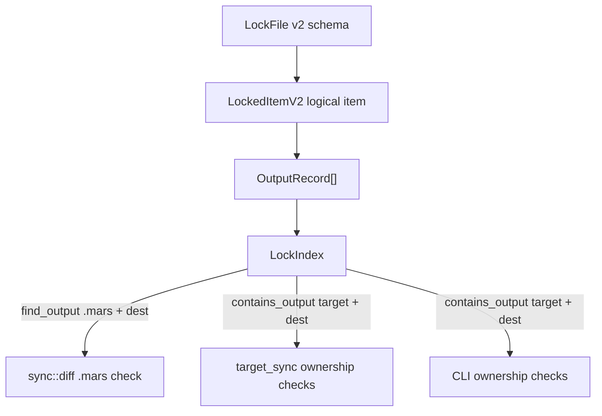

# src/lock/ — Target-Scoped Lock Outputs

`mars.lock` is the ownership registry for managed content. Lock v2 stores one
logical item with one or more output records. Every output record is scoped by
the target root that received it.

## Contracts

### Output identity is `(target_root, dest_path)`

`OutputRecord` has three fields that must be interpreted together:

| Field | Meaning |
|---|---|
| `target_root` | Directory Mars materialized into, such as `.mars`, `.codex`, `.pi`, `.agents` |
| `dest_path` | Path relative to that target root, such as `skills/planning` |
| `installed_checksum` | Hash of the bytes installed at that exact output |

The pair `(target_root, dest_path)` is the stable identity of an installed
output. `dest_path` alone is not unique once a project has multiple targets.

Native targets can lower the same source skill differently. A single skill can
therefore have multiple valid installed checksums:

```toml
[[items."skill/planning".outputs]]
target_root = ".mars"
dest_path = "skills/planning"
installed_checksum = "sha256:canonical..."

[[items."skill/planning".outputs]]
target_root = ".pi"
dest_path = "skills/planning"
installed_checksum = "sha256:pi-projected..."
```

### `LockIndex` is the read seam

`LockFile` preserves the persisted schema. `LockIndex` provides hot lookup
views over that schema:

| Method | Use |
|---|---|
| `find_output(target_root, dest_path)` | Diff, mutation, collision, and carry-forward checks for one concrete target |
| `contains_output(target_root, dest_path)` | Ownership checks for one concrete target |
| `find_by_dest_path(dest_path)` | Broad/legacy lookup where target root is intentionally irrelevant |
| `contains_dest_path(dest_path)` | Broad/legacy existence check |

New code that reasons about disk content under a target root should start with
the target-scoped methods. Unscoped methods are safe only when the caller is not
deciding ownership, modification status, or mutation permission for a concrete
target path.

### Canonical sync diff reads canonical outputs

Phase 4 sync diff compares the `.mars/` canonical store against the old lock.
It must use `.mars` output records:

```text
disk: .mars/skills/planning
lock: target_root = ".mars", dest_path = "skills/planning"
```

Comparing `.mars/skills/planning` to a `.pi` or `.codex` output checksum is
incorrect because those outputs may be valid target-specific projections. The
symptom is a false `disk-lock-divergent` / local-modified warning immediately
after a clean sync.

### Linked-target mutation uses the same identity

Linked-target deletion, overwrite, and orphan cleanup use the same
`(target_root, dest_path)` ownership contract. See
`../../target_sync/.context/CONTEXT.md` for the mutation-side rules.

## Architecture



The lock module should not know how each target lowers content. It only records
the outputs and provides target-scoped lookup semantics. Compiler and target
sync code decide what bytes to produce; lock lookup decides which recorded
checksum applies to the target being inspected.

## Rationale

The v2 schema already models per-target outputs. The bug class comes from
flattening those outputs into a `dest_path -> output` map and letting duplicate
paths overwrite each other. Sorting can make a later target win, so canonical
diff may read a linked/native target checksum even when `.mars` is clean.

Keeping the schema unchanged and fixing the ephemeral index preserves lock-file
compatibility while making the read model match the schema model.

## Patterns

- Use `CANONICAL_TARGET_ROOT` when the caller is checking `.mars/`.
- Use the configured target name when checking a linked/native target.
- Use `canonical_flat_items()` for `.mars`-only orphan scans.
- Use `flat_items_for_target(target_root)` for target-scoped listing.
- Use `flat_items()` only when the caller deliberately wants every output.
